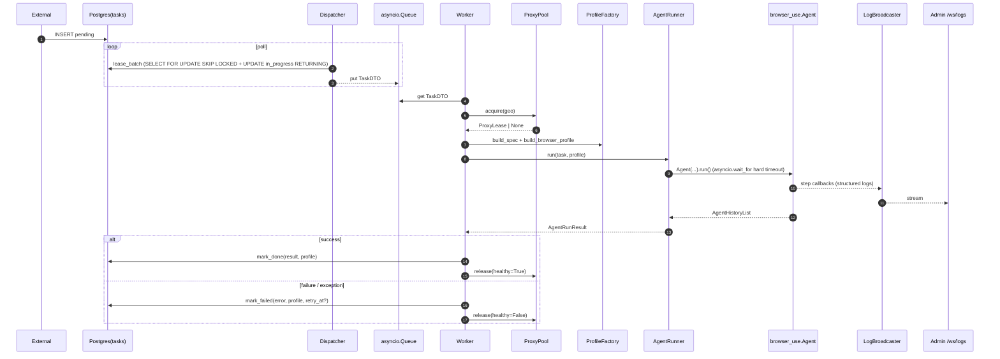

# agent-clicker — Архитектура проекта

> **⚠️ Production-реальность (важно, переопределяет §3/§4/§13 при конфликте):**
> Таблица `tasks` находится во **внешней** БД, на которую сервис имеет **только `SELECT` и `UPDATE`**. Схема жёстко зафиксирована владельцем БД и **не подлежит ALTER**:
> `id INTEGER PK`, `ad_id INTEGER NOT NULL` (FK→ads), `status VARCHAR NOT NULL`, `description TEXT NOT NULL`, `link VARCHAR NOT NULL`, `created_at TIMESTAMP DEFAULT now()`, `exec_time TIMESTAMP NULL`. Никаких enum/check-ограничений на status. Прочих колонок нет.
>
> Следствия:
> 1. **Две БД.** `EXTERNAL_TASKS_DSN` (внешняя, read+update на `tasks`) и `INTERNAL_STATE_DSN` (наша, owned). В dev обе могут быть одной локальной Postgres.
> 2. **Все служебные поля** (`attempts`, `max_attempts`, `last_error`, `worker_id`, `locked_at`, `profile`, `result`) переезжают в **`internal.task_runtime(task_id PK, ...)`**.
> 3. **Status — VARCHAR.** Значения: `created` (= pending, исходный статус из прод), `in_progress`, `done`, `failed`, `skipped`, `scheduled` (резерв под backoff). Без ENUM.
> 4. **`exec_time` — `TIMESTAMP WITHOUT TIME ZONE`** (UTC по соглашению). В коде все datetime — naive UTC (`datetime.utcnow()`).
> 5. **Admin Panel:** создание/удаление задач (`POST/DELETE /api/tasks`) доступно **только в dev-режиме** (флаг `enable_task_mutations`). В прод-режиме эндпоинты возвращают 403.
> 6. **Лизинг — cross-DB best-effort.** Сначала `SELECT ... FOR UPDATE SKIP LOCKED` + `UPDATE external.tasks SET status='in_progress', exec_time=now()` в транзакции внешней БД; затем upsert в `internal.task_runtime`. При сбое второго шага — компенсирующий `UPDATE external.tasks SET status='created'`.
> 7. **Watchdog** определяет зависшие задачи по `internal.task_runtime.locked_at < now() - lease_timeout AND status='in_progress'` (через JOIN external→internal по id) и возвращает их в `created`.

---

## 0. Общие архитектурные принципы

1. **Слоистая архитектура.** Чёткое разделение:
   - **Domain** (`domain/`) — DTO, enum, value-objects. Без зависимостей от инфраструктуры.
   - **Infrastructure** (`db/`, `proxy/`, `llm/`, `observability/`) — внешние интеграции.
   - **Application** (`queue/`, `workers/`, `browser/`) — бизнес-логика воркеров.
   - **Interface** (`admin/`) — HTTP/WebSocket интерфейс.
2. **Dependency Injection через композицию.** Зависимости передаются в конструктор. Глобальных синглтонов нет, кроме `Settings`, `LogBroadcaster`, `SettingsStore`, создаваемых в composition root (`main.py`).
3. **Async-only.** Любой I/O — через `await`. CPU-bound операции (хеши, мелкая сериализация) допустимы синхронно; тяжёлые — через `asyncio.to_thread`.
4. **Graceful shutdown.** Все долгоживущие компоненты реализуют `async def start()` и `async def stop()`. Главный процесс ловит `SIGTERM/SIGINT`, останавливает приём новых задач, дожидается завершения in-flight задач до `LEASE_TIMEOUT_SECONDS`, затем отменяет.
5. **Контракты — pydantic / frozen dataclass.** Все DTO между слоями — `pydantic.BaseModel` либо `dataclass(frozen=True, slots=True)`. ORM-объекты наружу из репозитория не отдаются.
6. **Идемпотентность.** Любая операция изменения статуса задачи в репозитории — атомарна и условна (`WHERE status = ...`).
7. **Конфигурация — двухуровневая.**
   - **Static `Settings`** (env-only) — секреты, DSN, хост/порт. Иммутабельны на старте.
   - **Dynamic settings** (`AgentSettings`, `BrowserProfileDefaults`, `WorkerRuntimeSettings`) — хранятся в таблице `settings`, редактируются из Admin Panel, читаются `SettingsStore` (кеш с TTL).

---

## 1. Структура репозитория

```
agent-clicker/
├── docker/
│   ├── Dockerfile                       # multi-stage, ставит chromium через playwright
│   └── entrypoint.sh                    # ждёт postgres, прогоняет alembic, запускает app
├── docker-compose.yml                   # app + postgres
├── pyproject.toml
├── uv.lock
├── alembic.ini
├── .env.example
├── .dockerignore
├── docs/
├── src/
│   └── agent_clicker/
│       ├── __init__.py
│       ├── __main__.py                  # python -m agent_clicker → asyncio.run(main.run())
│       ├── main.py                      # composition root
│       ├── lifecycle.py                 # Lifespan, signal handlers, graceful shutdown
│       ├── config.py                    # Settings + dynamic-settings pydantic-модели
│       │
│       ├── domain/
│       │   ├── task.py                  # TaskStatus, TaskDTO, TaskResult, TaskFilters, Page, AdProxyConfigDTO, TaskProxyConfigDTO
│       │   └── profile.py               # ProxyLease, ProfileSpec
│       │
│       ├── db/
│       │   ├── engine.py                # create_async_engine, async_sessionmaker
│       │   ├── models.py                # SQLAlchemy: Task, TaskRuntime, TaskProxy, AdProxyConfig, Setting
│       │   ├── repository.py            # TaskRepository, SettingsRepository, AdProxyRepository, TaskProxyRepository
│       │   └── migrations/
│       │       ├── env.py
│       │       └── versions/0001_initial.py
│       │
│       ├── settings_store.py            # SettingsStore: кеш + bootstrap
│       │
│       ├── llm/
│       │   └── factory.py               # build_llm(AgentSettings, Settings) → ChatOpenAI
│       │
│       ├── proxy/
│       │   └── pool.py                  # ProxyPool, ProxyLease
│       │
│       ├── profiles/
│       │   ├── catalog.py               # UA_CATALOG, VIEWPORT_PRESETS, GEO_LOCALE_TZ
│       │   └── factory.py               # ProfileFactory
│       │
│       ├── browser/
│       │   ├── runner.py                # AgentRunner, AgentRunResult
│       │   └── callbacks.py             # StepStreamCallback, DoneCallback
│       │
│       ├── queue/
│       │   ├── dispatcher.py            # Dispatcher: polling + лизинг
│       │   └── watchdog.py              # Watchdog: возврат зависших lease
│       │
│       ├── workers/
│       │   ├── worker.py                # Worker
│       │   └── pool.py                  # WorkerPool
│       │
│       ├── observability/
│       │   ├── logging.py               # configure_logging, JsonFormatter, ContextFilter
│       │   ├── broadcaster.py           # LogBroadcaster, LogBroadcastHandler
│       │   └── artifacts.py             # ArtifactStore
│       │
│       └── admin/
│           ├── app.py                   # create_app(...)
│           ├── dependencies.py          # FastAPI DI
│           ├── schemas.py               # request/response модели
│           ├── routers/
│           │   ├── tasks.py
│           │   ├── settings.py
│           │   ├── artifacts.py
│           │   ├── health.py
│           │   └── logs_ws.py
│           ├── templates/{base,tasks,settings,logs}.html
│           └── static/{app.js,style.css}
├── tests/
│   ├── conftest.py
│   ├── unit/
│   ├── integration/
│   └── e2e/
└── artifacts/                            # gitignored, mount-point в docker
```

---

## 15. Flow одной задачи



---

## 17. Best practices & failure modes (обязательны в коде)

1. **Сессии БД** — короткоживущие: `async with session_factory() as s: async with s.begin(): ...`.
2. **Лизинг и блокировки** — одна транзакция `WITH ... FOR UPDATE SKIP LOCKED + UPDATE RETURNING`. Никаких race conditions.
3. **Hard timeout на `agent.run()`** — `asyncio.wait_for(timeout=lease_timeout - 30)`. Защита от превышения lease.
4. **Cleanup tmpdir** — `browser-use` сам управляет tmpdir при `user_data_dir=None`. В `finally` явно вызвать `await agent.close()` если API его предоставляет.
5. **PII / секреты в логах** — `last_error` обрезается до 4000 символов; в логи не пишутся `description`, прокси-пароли, LLM-ключи.
6. **Backpressure WebSocket** — bounded `asyncio.Queue(maxsize=1000)` per subscriber; overflow → drop oldest + warning.
7. **`updated_at`** — отображается во фронте Admin, чтобы операторы видели применение настроек.
8. **Health endpoints** — `/healthz`, `/readyz` для docker `healthcheck`.
9. **Метрики** — точка расширения `observability/metrics.py` оставлена пустой (заглушка), Prometheus подключается позже.
10. **Тесты**:
    - `tests/conftest.py` поднимает Postgres через `testcontainers-python` (либо использует `pytest-postgresql`).
    - `browser_use.Agent` мокается `AsyncMock`, возвращающим stub `AgentHistoryList`.
    - Каждый репозиторный метод покрыт хотя бы одним тестом (happy + один failure).

---

## 18. Уточнения / доработки бизнес-логики поверх тех. спецификации

1. **Таблица `settings`** добавлена. Без отдельного хранилища невозможно «изменять настройки без перезапуска».
2. **`SettingsStore` с TTL=5s** — компромисс между свежестью и нагрузкой; явно вызываемая `invalidate()` после `update_*` сводит lag к нулю в active-replica деплое.
3. **Обновление `exec_time` в `lease_batch`** атомарно с переходом в `in_progress`.
4. **`result.scheduled_at` / `result.started_at` / `result.finished_at`** заполняются в `Worker._handle`.
5. **Hard timeout** на `agent.run()` обязателен.
6. **WebSocket back-pressure** — обязательная защита от медленных клиентов.
7. **Health endpoints** добавлены — нужны для docker `healthcheck`.
8. **`worker_concurrency` — фиксируется на старте.** Динамическое масштабирование out-of-scope MVP; в Admin UI поле помечено «requires restart».
9. **ProxyPool допускает пустой пул** — задачи идут напрямую (dev-режим).
10. **`extend_system_message`** — композиция: пользовательский текст из `AgentSettings.extend_system_message` + динамический блок с `MIN/MAX_TIME_ON_SITE_SECONDS` из `WorkerRuntimeSettings`.
11. **CancelledError при graceful shutdown** освобождает lease (`retry_at=now()`) — задача мгновенно подхватится после рестарта, без ожидания watchdog.
12. **Lease-таймаут > hard-таймаут agent.run** на 30s — окно для записи `mark_failed/mark_done` до того, как watchdog заберёт задачу.
13. **`ProfileFactory` пересоздаётся в воркере** перед каждой задачей со свежими `BrowserProfileDefaults` из `SettingsStore` — это гарантирует применение настроек браузера без рестарта.

---

## 19. Чеклист для реализации нового модуля

При добавлении кода (AI и человеком одинаково):

- [ ] Все публичные функции/методы имеют type-hints, `mypy --strict` проходит.
- [ ] I/O — только async; никаких `requests`, `time.sleep`, синхронных DB-вызовов.
- [ ] Конфигурация — через `Settings` / `SettingsStore`, не через `os.environ`.
- [ ] БД-операции — только через `TaskRepository` / `SettingsRepository`.
- [ ] Логирование — `logger.info("event.name", extra={...})`, без секретов и PII.
- [ ] Исключения в горячем пути воркера ловятся, задача не валит процесс.
- [ ] Есть unit-тест happy-path и хотя бы один failure-path.
- [ ] Если меняется схема БД — есть alembic-миграция.
- [ ] Если добавлен новый dynamic-параметр — обновлены `AgentSettings` / `BrowserProfileDefaults` / `WorkerRuntimeSettings`, дефолты в `bootstrap()`, поле в Admin UI и роутере.
- [ ] Если код запускает внешний процесс или сетевой вызов — есть таймаут.
- [ ] Никаких прямых вызовов Playwright API — только через `browser_use.Agent`.
